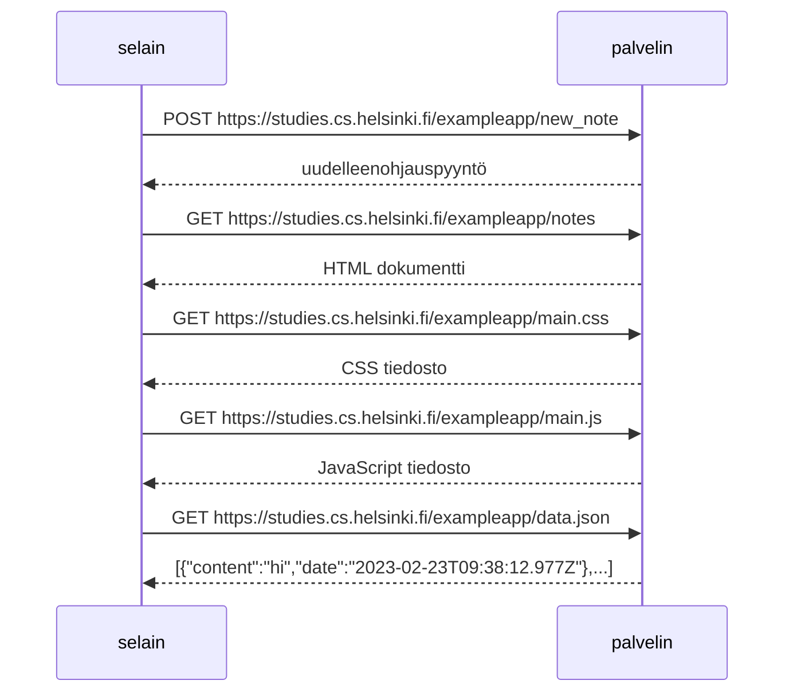

```mermaid
sequenceDiagram
participant selain
participant palvelin
    selain->>palvelin: POST https://studies.cs.helsinki.fi/exampleapp/new_note
    palvelin-->>selain: uudelleenohjauspyyntö
    selain->>palvelin: GET https://studies.cs.helsinki.fi/exampleapp/notes
    palvelin-->>selain: HTML dokumentti
    selain->>palvelin: GET https://studies.cs.helsinki.fi/exampleapp/main.css
    palvelin-->>selain: CSS tiedosto
    selain->>palvelin: GET https://studies.cs.helsinki.fi/exampleapp/main.js
    palvelin-->>selain: JavaScript tiedosto
    selain->>palvelin: GET https://studies.cs.helsinki.fi/exampleapp/data.json
    palvelin-->>selain: [{"content":"hi","date":"2023-02-23T09:38:12.977Z"},...]

```
